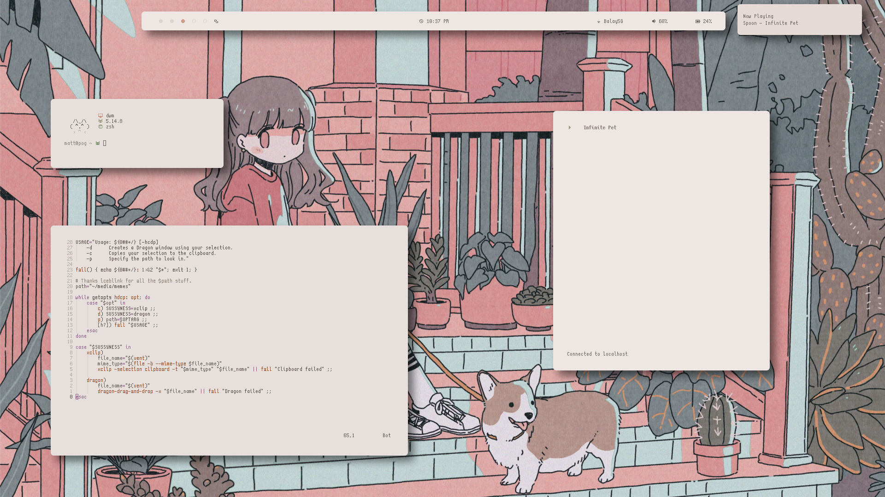
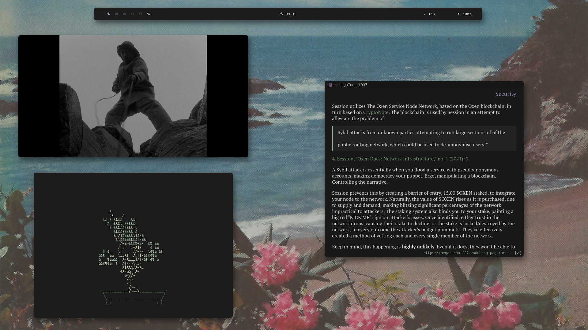
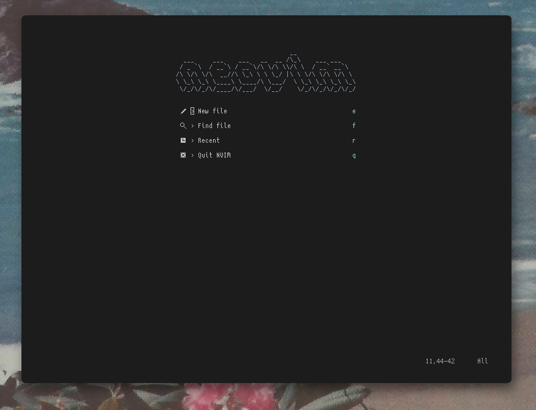
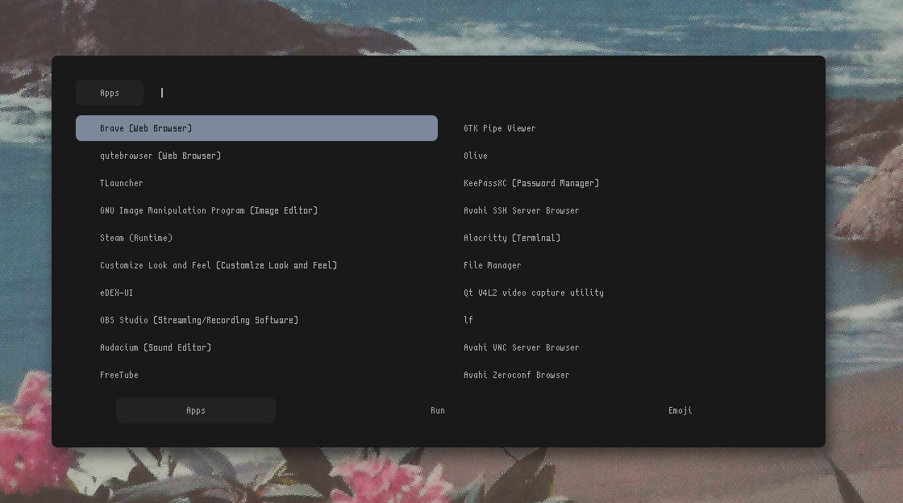

# Pogfiles
My config files for stuff, powered by Effort®.

> "It'll make you bust a nut--scratch that, 2." - Nobody

# Blossom
## Bunch of stuff

<!-- # Mountain -->
<!-- ## Bunch of stuff -->
<!--  -->
<!--  -->
<!-- ## Neovim -->
<!--  -->
<!--  -->
<!-- ## Rofi -->
<!--  -->

# Alright shit you need
## Programs 
* Audio - ncmpcpp
* Audio editing - Audacium
* Bar - Polybar
* Docs - Zathura
* Files - LF
* Menu - Rofi
* Notif - Dunst
* Pixel art - Aseprite
* Shell - ZSH
* Term - Alacritty
* Text - Neovim
* Video - MPV
* Video editing - Olive
* WM - dwm
* Web - Qutebrowser

## Misc 
I recommend using `otb` variants, ergo [siji-ng](https://github.com/begss/siji-ng), as a lot of modern programs [prefer them](https://bbs.archlinux.org/viewtopic.php?pid=1940532#p1940532).
* Font - Curie
* Icon font - Siji
* Screen/Teleplays - LaTeX 
* Long form essay - groff

# License
Licensed under [EUPL 1.2](LICENSE.md).
